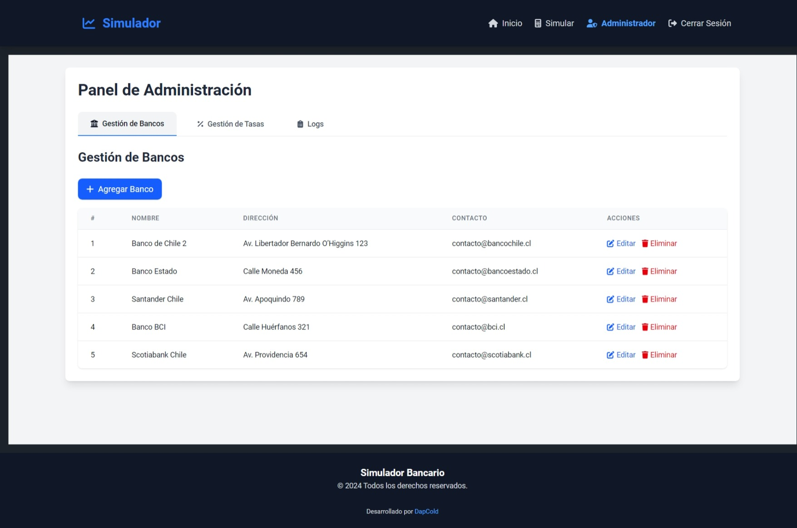
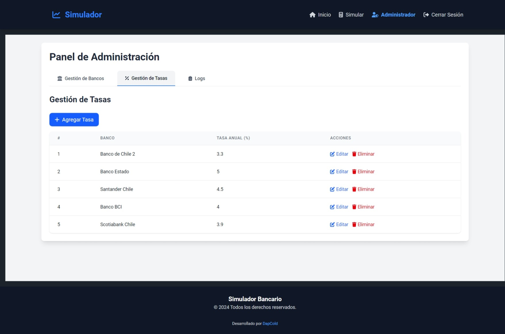
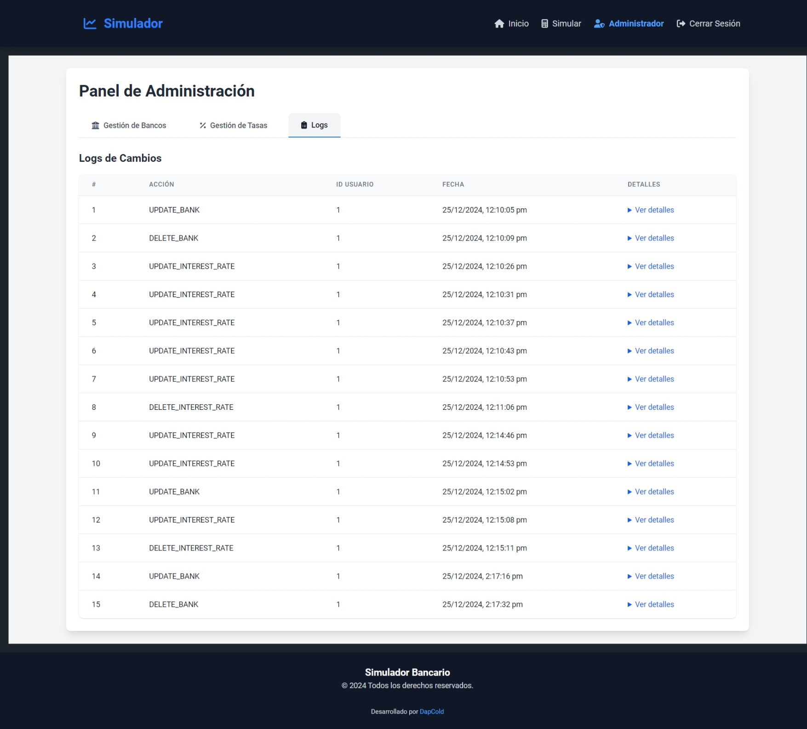

# Simulador de Rendimientos y Panel de Administración - Frontend

## Descripción

Este proyecto es la interfaz del usuario para un sistema que permite simular rendimientos financieros y administrar bancos y tasas de interés. El frontend está diseñado para interactuar con el backend mediante API RESTful y ofrece una experiencia responsiva tanto para dispositivos móviles como para escritorio.

Incluye:
- **Simulación de Rendimientos**: Permite a los usuarios calcular el rendimiento esperado seleccionando un banco, monto y plazo.
- **Panel de Administración**: Exclusivo para usuarios con rol de administrador, permite gestionar bancos, tasas de interés y visualizar los logs de cambios.

---

## Tecnologías Utilizadas

- **Framework Principal**: React 19 con TypeScript
- **Herramienta de Construcción**: Vite
- **Estilización**: 
  - TailwindCSS v4
  - DaisyUI
  - FontAwesome para iconos
- **Gestión del Estado Global**: Context API
- **Autenticación**: JWT

---

## Características

### Usuario
- **Simulación de Rendimientos**:
  - Seleccionar banco, monto y plazo para calcular el rendimiento esperado.

### Administrador
- **Gestión de Bancos**:
  - Crear, editar y eliminar bancos.
- **Gestión de Tasas de Interés**:
  - Administrar tasas de interés asociadas a los bancos.
- **Logs de Cambios**:
  - Visualizar un historial de acciones realizadas, incluyendo usuario, acción, datos anteriores y nuevos.

### Autenticación
- Inicio y cierre de sesión con JWT.
- Roles (ADMIN/USER) para gestionar el acceso a vistas protegidas.

---

## Capturas de Pantalla

### Simulación de Rendimientos


### Panel de Administración


### Logs de Cambios


---

## Instalación y Configuración

### Prerrequisitos

- Node.js >= 22.x
- Gestor de paquetes: `pnpm` (recomendado)

### Configuración del Entorno

1. Clona el repositorio:
   ```bash
   git clone https://github.com/Primo18/simulador-rendimientos-frontend.git
   cd simulador-rendimientos-frontend
   ```

2. Crea un archivo `.env` en la raíz del proyecto con la siguiente configuración:
   ```env
   VITE_BACKEND_URL=http://localhost:3000/api
   ```

### Instalación de Dependencias

Ejecuta el siguiente comando para instalar las dependencias necesarias:
```bash
pnpm install
```

### Ejecución del Proyecto

Para iniciar el servidor de desarrollo:
```bash
pnpm dev
```
---
### **Usuarios**
- `admin` (rol: `ADMIN`, contraseña: `admin123`).
- `user` (rol: `USER`, contraseña: `user123`).

---

## Estructura del Proyecto

```plaintext
src/
  components/           # Componentes reutilizables
  context/              # Contextos globales
  hooks/                # Hooks personalizados
  pages/                # Vistas principales
    Admin.tsx           # Panel de administración
    Home.tsx            # Página de inicio
    Login.tsx           # Página de inicio de sesión
    Register.tsx        # Página de registro
    Simulate.tsx        # Página de simulación
  services/             # Servicios de interacción con la API
  App.tsx               # Componente raíz
  main.tsx              # Punto de entrada principal
```

---

## Endpoints Consumidos

### Autenticación
- **POST** `/users/login`: Iniciar sesión
- **POST** `/users/register`: Registrar usuario

### Bancos
- **GET** `/banks`: Listar bancos
- **POST** `/banks`: Crear banco
- **PUT** `/banks/:id`: Editar banco
- **DELETE** `/banks/:id`: Eliminar banco

### Tasas de Interés
- **GET** `/rates`: Listar tasas
- **POST** `/rates`: Crear tasa
- **PUT** `/rates/:id`: Editar tasa
- **DELETE** `/rates/:id`: Eliminar tasa

### Logs
- **GET** `/logs`: Listar logs de acciones

